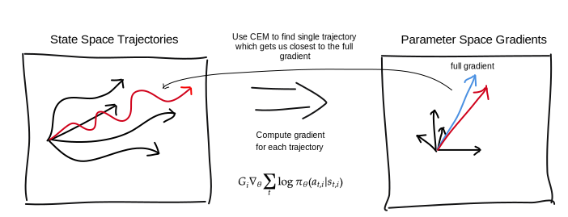
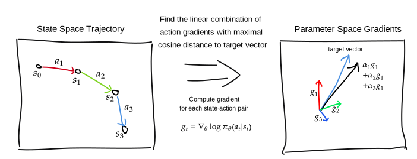
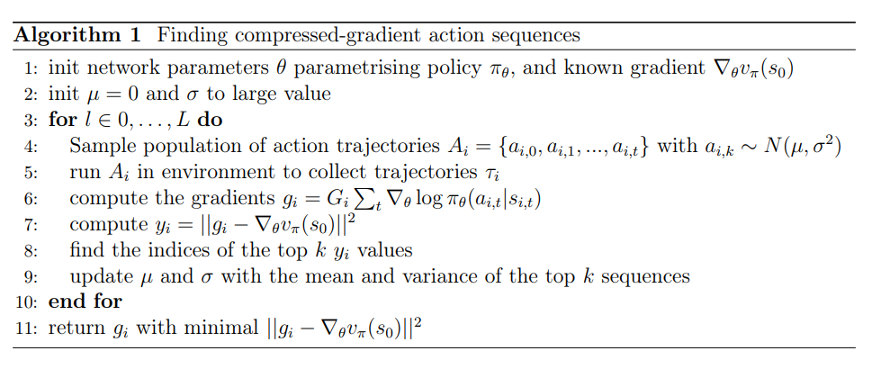
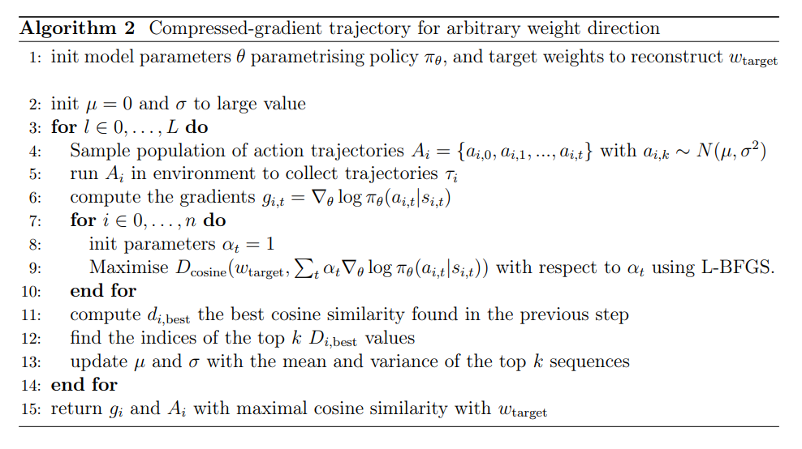

# Finding RL Trajectories With Very Informative Gradients

This project aims to answer the following question: can an RL agent learn everything it needs from a single highly optimised state-action trajectory, or do we fundamentally need a dataset of behaviors in order to learn the optimal policy?

The punchline: it seems possible, at least in Mujoco, to manufacture a single trajectory which lets a policy-gradient agent learn interesting behavior. And moreover this optimal trajectory does not at all ressemble expert behavior on the task.

## Video of Optimised "Informative Trajectory"
Here is a video of a state-action trajectory specifically optimised to be maximally "informative" in a sense to be described later. Notice the total lack of anything that could ressemble expert behavior. 

https://github.com/RazCiuca/6163_project_grad_compression/assets/112354159/ce80b4e9-a9ac-4bb6-98c8-2f1e749fb2bf

## Final Behavior Trained Only On That Trajectory
And this is the policy we get by training only on the above trajectory with policy gradients. Not expert behavior by any means, but we can clearly see attempts at walking behavior, learned from a trajectory which did not contain such behavior.

https://github.com/RazCiuca/6163_project_grad_compression/assets/112354159/f5897494-9508-4a7a-a184-0b16340801fe

# Project Introduction

Loosely inspired by the research into adversarial examples for image recognition models, we introduce the idea of "gradient compression" for policy gradient models, which consists in finding single state-action sequences which lead to gradients which closely match the full parameter change that occurs over the entire training history of a policy gradient model. Finding such action sequence that produces a gradient with high cosine similarity to the full weight change would let us fully train a model by computing the gradient of a single trajectory, and doing line search in that direction. The feasibility of this approach has interesting implications for the internal structure of policy gradient methods. If gradients turn out to be very compressible, it suggests the existence of a sampling method which might learn to generate these "gradient-compressed trajectories" from scratch, thereby greatly increasing the sample efficiency of policy gradient methods.

On a set of mujoco environments using a quadratic agent and a small neural network agent, we explore just how much the policy gradient and the entire weight change can be compressed into single sequences of actions. The effect of model architecture on this compressibility, how much random weight directions can be compressed in this way, the relationship between the maximum achievable cosine similarity and the length of trajectory we optimise, and finally we "decompress" the compressed gradients we found to get back an approximation of the optimal policy.

# background

The main theoretical background of this work is the policy gradient theorem, which states that the gradient of the sum of future reward $v_\pi(s_0)$ with respect to the free parameters of our policy $\pi_\theta(a|s)$ is given by the following expression, first expressed as an expectation value, and then expressed as a finite sample approximation.

$$ \nabla_\theta v_{\pi_\theta}(s_0) = E_{\tau \sim \pi_\theta}\bigg[G \sum_t \nabla_\theta \log \pi_\theta (a_t|s_t)\bigg]$$
$$G \equiv \sum_t r_t$$
$$\nabla_\theta v_{\pi_\theta}(s_0) \approx \frac{1}{N} \sum_i \bigg( G_i \sum_{t} \nabla_\theta \log \pi_\theta (a_{t,i}|s_{t,i}) \bigg)$$

This result assumes that we are sampling state trajectories according to the current version of the policy $\pi_\theta$, if we are sampling according to a different policy, we need to use importance sampling, which allows us to compute expectations of a quantity $x$ with distribution $p(x)$ from samples from $q \neq p$: $E_{x\sim p}[x] = E_{x \sim q}\big[\frac{p(x)}{q(x)} x\big]$. Written for the policy gradient theorem, this becomes:

$$\nabla_\theta v_{\pi_\theta}(s_0) = E_{\tau \sim q}\bigg[\frac{p(\tau)}{q(\tau)} G \sum_t \nabla_\theta \log \pi_\theta (a_t|s_t)\bigg]$$
$$\nabla_\theta v_{\pi_\theta}(s_0) = E_{\tau \sim \pi'}\bigg[\frac{\prod_t \pi_\theta(a_t|s_t)}{\prod_t \pi'(a_t|s_t)} G \sum_t \nabla_\theta \log \pi_\theta (a_t|s_t)\bigg]$$

The last bit of theory we need is the Cross-Entropy Method for optimizing a function $f(x)$ for which we do not have access to explicit derivatives $\nabla f(x)$. For us $x$ will be a candidate sequence of actions $ a_1, a_2, ..., a_t $. CEM begins by generating an initial population of solutions $x_i \sim N(0, \sigma_0^2)$ with a $\sigma$ large enough that we are confident the optimal solution will be covered with appreciable probability. We evaluate each point $x_t$ to obtain $y_i = f(x_i)$. We then keep the top $r$ points, fit a new gaussian distribution to these points, and sample again to produce the next iteration of points. We note that since the variance can only decrease with successive iterations, it's important to set the initial variance large enough. A easy improvement to this basic method involves fitting a linear function to $\{x_i, y_i\}$, which gives us an estimate of the gradient, and then updating the mean of our gaussian distribution at each iteration in the direction of this computed gradient. 

# Finding Gradient-Compressed Trajectories

In this section, we will define what we mean by "gradient-compressed trajectories" and justify why such a concept is useful and interesting. Given a parametrised policy $\pi_\theta$ and a set of trajectories $\tau_i \sim \pi_\theta$, we can compute the gradient $g_i$ for each of these trajectories and therefore approximate the true policy gradient by $\frac{1}{n} \sum_i g_i$ only in the limit $n\rightarrow \infty$. We notice that the policy gradient theorem provides a procedure for turning numbers representing sequences of actions $A = \{a_0, ..., a_t\}$ into numbers representing gradients with respect to $\theta$. Call this procedure $g(A)$ and let $\nabla_\theta v_\theta(s_0)$ be the full policy gradient. 

We can now view the sequence of actions $A$ as our optimization target and attempt to find a single sequence $A$ such that $||g(A) - \nabla_\theta v_\theta(s_0)||^2$ is minimized. The full policy gradient requires a great deal of environment interaction to compute and, by finding a single action sequence which allows us to compute a gradient as close as possible to the true one, we have effectively "compressed" all the useable information of a large sample of trajectories into a single one. This trajectory "punches above its weight", so to speak, in terms of how useful it is for learning the optimal policy. Furthermore, we do not need to limit ourselves to optimizing a single trajectory: we can view a set of trajectories as our optimization variable instead to better approximate the full gradient.

There are three extensions of this basic idea that we can explore. First, we are not limited to  compressing the policy gradient: we can in principle try to find action trajectories which lead to gradients close to an arbitrary direction in space, hence we can try to "compress" a completely random direction in parameter space, or directly compress the full parameter change from the beginning of training to the end of training, this latter extension is what we do in this project. Second, finding trajectories which directly minimize the distance $||g_i - \nabla_\theta v_\pi(s_0)||^2$ might be too hard, since the compressed gradient not only has to match the direction of the full target vector, but also its magnitude. Maximizing the cosine similarity instead of the squared L2 norm fixes this problem. We discuss the third extension in the next section.

Visualization of gradient compression, going from state-space trajectories to weight space gradients. The blue arrow is the full policy gradient computed from a large sample of trajectories. The red trajectory is our optimized action sequence resulting in a gradient as close as possible to the blue arrow.

# Finding Maximal Cosine Similarity Vectors in the Span of Single State-Action Gradients

Instead of simply summing over the log likelihoods $\sum_{t} \nabla_\theta \log \pi_\theta (a_{t,i}|s_{t,i}) $ of each action in the trajectory that we are considering in order to compute the gradient that we wish to be close to our target compression vector, we can also learn a weighing $\sum_{t} \alpha_t \nabla_\theta \log \pi_\theta (a_{t,i}|s_{t,i}) $ for each action. Roughly, instead of finding a trajectory that should be uniformly encouraged in order to lead to the vector we want to reconstruct, we allow for differences between the actions considered. More precisely, if $g_t \equiv \nabla_\theta \log \pi_\theta (a_{t}|s_{t})$ is the gradient for the state-action pair $(s_t, a_t)$, we wish to find coefficients $\alpha_t$ such that $D_{\text{cosine}}(w_{\text{target}}, \sum_t \alpha_t \nabla_\theta \log \pi_\theta (a_{t}|s_{t}))$ is maximized. Finding these parameters $\alpha_t$ is a nontrivial optimisation problem and we use the BFGS optimization algorithm to solve it. See figure 2 and algorithm 2 for a visualisation and precise description.

Visualization of algorithm 2. For a fixed state-action trajectory, we can find the optimal weighing $\alpha_i$ for each action in the sequence in order to maximize the similarity with a target vector, shown here in blue. The red, green and blue arrows $g_i$ correspond to individual transition gradients which are then weighed over to produce the black arrow. Note that in two dimensions any two independent vectors would be enough to fully reproduce any target vector, but this situation is very different in high dimensional spaces

